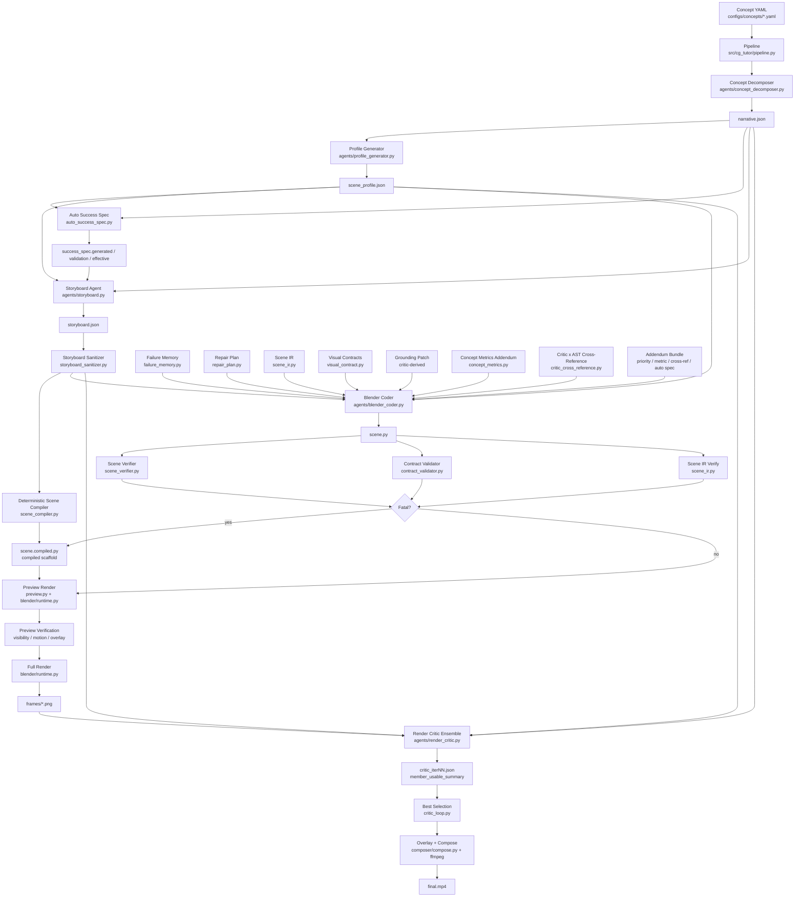
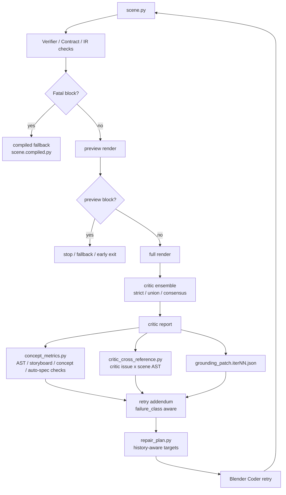
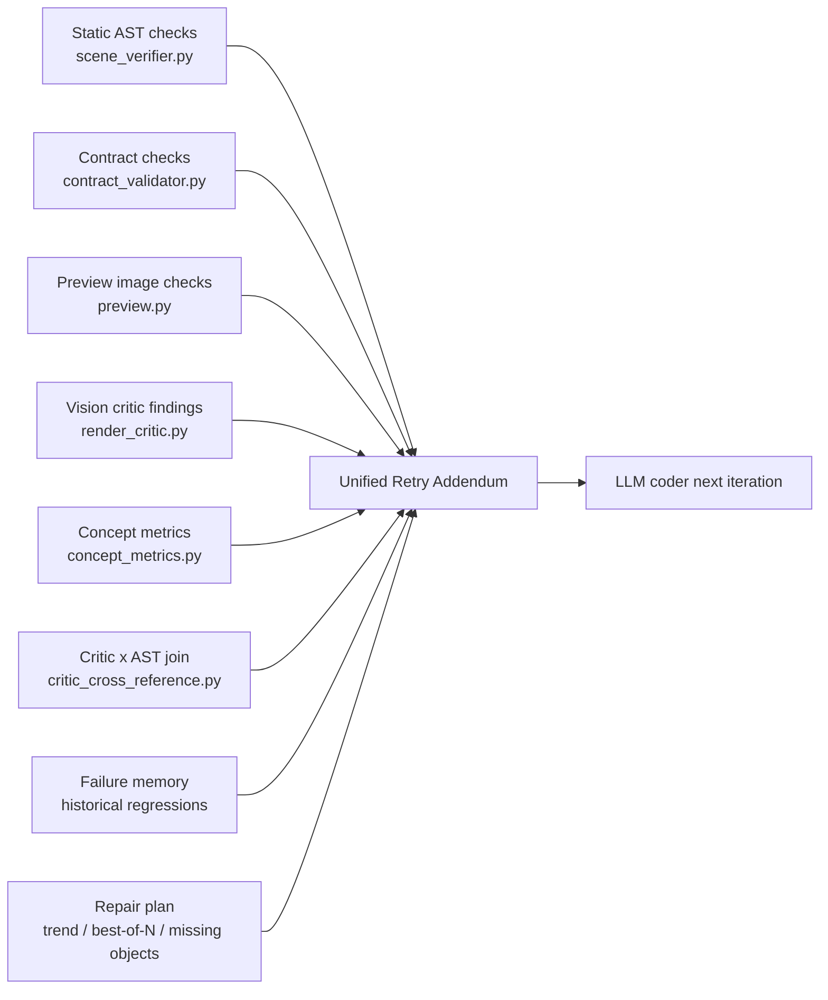

# CG-Tutor Architecture Overview

This document summarizes the current end-to-end framework in three views:

1. Control flow: concept YAML to final MP4
2. Diagnostic and retry loop
3. Code module layering

Paper-ready vector figures generated from the current code structure:

- `report/figures/architecture_pipeline.pdf` / `.svg`
- `report/figures/architecture_feedback_loop.pdf` / `.svg`
- `report/figures/architecture_module_layers.pdf` / `.svg`

Regenerate them with:

```bash
MPLCONFIGDIR=/tmp .venv/bin/python scripts/generate_architecture_figures.py
```

## 1. End-to-End Control Flow



## 2. Retry and Diagnostic Loop



## 3. Signal Routing



## 4. Module Layering

```text
cg_tutor/
├── pipeline.py                     # Top-level orchestration: YAML -> mp4
├── config.py                       # Pipeline-level configuration loader
├── llm_client.py                   # Unified LLM client with provider-chain fallback
├── correction_controller.py        # Retry routing when local repair stalls
├── terminal_ui.py                  # Run-time progress / log surface
├── _logging.py                     # Structured logging setup
│
├── agents/
│   ├── base.py                     # Shared agent helpers (artifact save, retries)
│   ├── concept_decomposer.py       # Concept decomposition
│   ├── profile_generator.py        # Scene profile generation
│   ├── storyboard.py               # Storyboard generation / patching
│   ├── blender_coder.py            # scene.py generation / diff repair
│   ├── render_critic.py            # Single critic / ensemble critic
│   └── latex_overlay.py            # Formula / annotation overlay agent
│
├── scene_compiler.py               # Deterministic scaffold / compiled fallback
├── scene_verifier.py               # AST / animation / safety verification
├── scene_state.py                  # Static scene-state audit (objects / keyframes)
├── scene_profiles.py               # Scene-level visual policy profiles
├── contract_validator.py           # Visual contract validation
├── visual_contract.py              # Required anchors / labels / vectors by shot
├── preview.py                      # Preview render verification
├── critic_loop.py                  # Best-of-N / trend / critic history logic
├── repair_plan.py                  # Retry target planning
├── failure_memory.py               # Cross-run memory
├── scene_ir.py                     # Intermediate scene representation
├── success_spec.py                 # Manual Success Spec schema / formatting
├── auto_success_spec.py            # Generated soft Success Spec rules
├── concept_metrics.py              # Concept-specific + auto-spec deterministic checks
├── critic_cross_reference.py       # Critic finding x AST evidence join
├── storyboard_sanitizer.py         # Storyboard cleanup
│
├── prompts/                        # Prompt templates per agent
│
├── blender/
│   ├── runtime.py                  # Blender execution wrapper (WSL / Win / Linux)
│   ├── primitives.py               # Reusable bpy primitive builders
│   └── templates/                  # Bundled scene templates
│
├── composer/
│   ├── compose.py                  # Overlay + ffmpeg composition
│   ├── ffmpeg_wrapper.py           # ffmpeg invocation / probe helpers
│   └── formula_render.py           # LaTeX / formula image rendering
│
├── eval/
│   └── metrics.py                  # Run-summary metrics for manual scoring
│
├── schemas/
│   ├── feedback.py                 # CriticIssue / CriticReport
│   ├── narrative.py                # Narrative / concept decomposition schema
│   └── storyboard.py               # Storyboard schema
│
└── configs/concepts/*.yaml         # Concept specifications
```

## 5. Current Control Principles

```text
Concept Spec
   -> LLM proposes candidate visuals and code
   -> Auto Success Spec derives soft, machine-readable success evidence
   -> Deterministic layers reject obvious structural failures
   -> Preview and critic inspect the rendered result
   -> Cross-reference / metrics / repair planning convert symptoms back
      into actionable structural fixes
   -> Next iteration retries with tighter constraints
```

The current selection and pass logic is deliberately conservative:

- Legacy `block` / `warn` is preserved, but `failure_class` separates
  `structural_fatal`, `success_hard`, `success_soft`, and `aesthetic_warn`.
- `structural_fatal` and `success_hard` outrank critic score in best
  selection.
- Generated Auto Success Spec rules start soft and do not hard-fail iter00.
- Critic member reports with useful issues are retained even when that
  backend also has a partial execution/parsing error.
- `compiled_fallback` is a diagnostic safety net, not a quality improvement;
  degraded fallback output cannot silently become `pass`.

## 6. Current Practical Reading

- `pipeline.py` is the control plane.
- `scene_compiler.py` is the deterministic safety net.
- `render_critic.py` is the visual evaluation layer.
- `success_spec.py` / `auto_success_spec.py` define explicit success signals.
- `concept_metrics.py` and `critic_cross_reference.py` are the bridge
  modules that try to turn post-hoc visual findings into reusable,
  machine-actionable repair signals.
