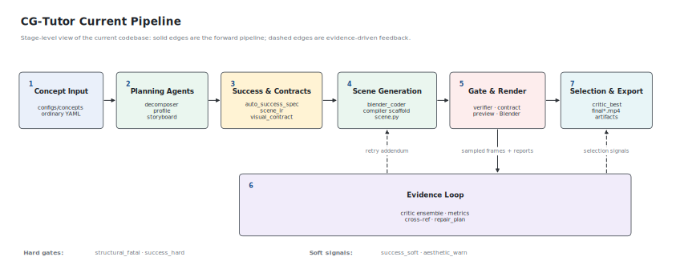
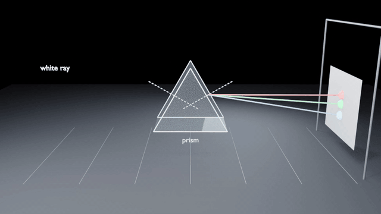
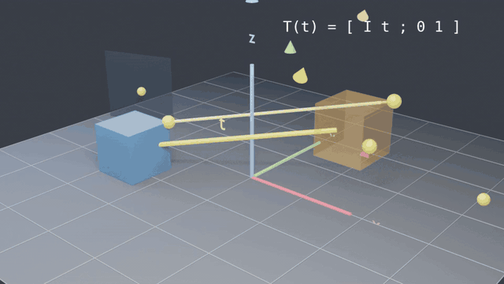
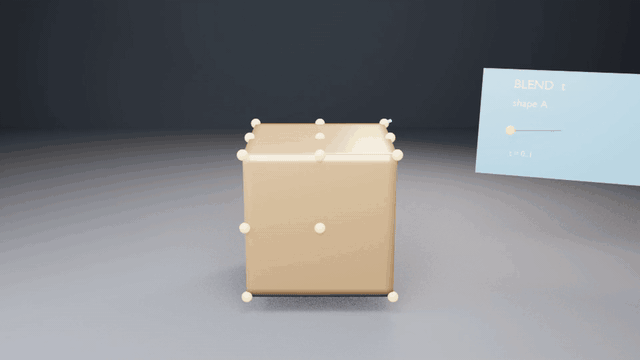
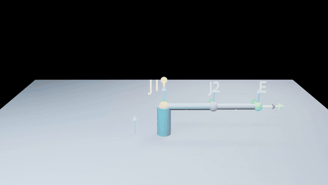

# CG-Tutor

**CG-Tutor turns ordinary computer graphics concept YAML files into short
Blender teaching animations through an agentic generate-check-repair loop.**

The project was built for **2026 Spring Computer Graphics Project 3**. It
focuses less on one-off prompt demos and more on a reproducible pipeline:
concept decomposition, storyboard planning, Blender scene generation, static
verification, visual contracts, critic feedback, conservative best selection,
and compact review artifacts.



## Video Gallery

The repository keeps five current generated scenes. Each scene includes the
main `final.mp4` plus four alternative selection exports.

GitHub does not reliably render repository-local MP4 files inline in Markdown,
so the gallery uses full-length animated GIF previews. Each preview plays the
complete 16-18 second clip in the README and links to the original MP4 file.

| Prism Dispersion Teaching | Mirror Reflection |
| --- | --- |
| [](https://raw.githubusercontent.com/AssassinCow/CG-PJ3/main/outputs/prism_dispersion_teaching/final.mp4) | [](https://raw.githubusercontent.com/AssassinCow/CG-PJ3/main/outputs/mirror_reflection/final.mp4) |
| [Open video](https://raw.githubusercontent.com/AssassinCow/CG-PJ3/main/outputs/prism_dispersion_teaching/final.mp4) | [Open video](https://raw.githubusercontent.com/AssassinCow/CG-PJ3/main/outputs/mirror_reflection/final.mp4) |

| Affine Transformation | Shape Morphing |
| --- | --- |
| [](https://raw.githubusercontent.com/AssassinCow/CG-PJ3/main/outputs/affine_transformation/final.mp4) | [](https://raw.githubusercontent.com/AssassinCow/CG-PJ3/main/outputs/shape_morphing/final.mp4) |
| [Open video](https://raw.githubusercontent.com/AssassinCow/CG-PJ3/main/outputs/affine_transformation/final.mp4) | [Open video](https://raw.githubusercontent.com/AssassinCow/CG-PJ3/main/outputs/shape_morphing/final.mp4) |

Additional retained result:
[](https://raw.githubusercontent.com/AssassinCow/CG-PJ3/main/outputs/forward_kinematics_chain/final.mp4)

[Open Forward Kinematics Chain video](https://raw.githubusercontent.com/AssassinCow/CG-PJ3/main/outputs/forward_kinematics_chain/final.mp4)

## What This Repository Contains

Current retained concepts:

| Concept | Teaching target |
| --- | --- |
| `affine_transformation` | matrix and coordinate transformation |
| `forward_kinematics_chain` | hierarchical transforms and end-effector motion |
| `mirror_reflection` | incident ray, reflected ray, surface normal, angle relation |
| `prism_dispersion_teaching` | prism dispersion, RGB rays, internal light path |
| `shape_morphing` | interpolation and morphing between shapes |

The public snapshot intentionally keeps only compact review artifacts:

- final videos: `final.mp4`, `final_balanced.mp4`, `final_compliance.mp4`,
  `final_aesthetic.mp4`, `final_semantic.mp4`
- generation summaries: `narrative.json`, `storyboard.json`,
  `scene_profile.json`
- structured checks: `scene_ir.json`, `visual_contracts.json`,
  `success_spec.generated.json`, `success_spec.validation.json`,
  `success_spec.effective.json`
- final scripts and selection metadata: `scene.py`, `scene.compiled.py`,
  `critic_best.json`, `video_exports.json`

Large debug traces, raw model responses, preview frames, stdout/stderr logs,
and per-iteration repair files are ignored so the repository stays readable.

## Architecture At A Glance

```text
Concept YAML
  -> Concept Decomposer
  -> Scene Profile
  -> Auto Success Spec
  -> Storyboard
  -> Scene IR / Visual Contract
  -> Deterministic Compiler Scaffold
  -> Blender Coder
  -> Verifier / Contract / Preview
  -> Render
  -> Critic Ensemble
  -> Metrics / Cross-reference / Repair Plan
  -> Best Selection
  -> final.mp4
```

Key ideas:

- **Auto Success Spec** converts natural-language intent into soft,
  machine-readable success evidence without requiring users to hand-write a
  metric for every scene.
- **Failure classes** separate structural failures, hard success failures,
  soft success evidence, and aesthetic warnings.
- **Critic ensemble partial success** keeps usable findings even when one
  critic backend returns partial execution or parse errors.
- **Diagnostic fallback** keeps broken runs renderable for analysis, while
  avoiding false `pass` claims.
- **Vector/ray scaffolding** gives optics and transformation scenes a minimum
  semantic skeleton before critic repair.

## Setup

```bash
cd cg-tutor
python3 -m venv .venv
source .venv/bin/activate
pip install -e .[dev]
cp .env.example .env
```

Required external tools:

- Blender 4.0+ or Blender 5.x
- ffmpeg
- API credentials or CLI authentication for the configured LLM providers

Model routing is configured in:

```text
configs/models_api.yaml
configs/models_cli.yaml
```

The default API config uses official OpenAI, Anthropic, and Google-style
provider settings. Custom base URLs are optional and must be supplied through
environment variables rather than committed configuration.

## Run A Concept

Default EEVEE run:

```bash
MPLCONFIGDIR=/tmp CG_TUTOR_API_TIMEOUT=300 \
.venv/bin/python scripts/run_concept.py prism_dispersion_teaching \
  --out-root outputs \
  --critic-ensemble claude,gpt \
  --critic-strictness union \
  --max-critic-iters 3
```

Cycles / GPU attempt:

```bash
MPLCONFIGDIR=/tmp CG_TUTOR_API_TIMEOUT=300 \
.venv/bin/python scripts/run_concept.py mirror_reflection \
  --out-root outputs \
  --critic-ensemble claude,gpt \
  --critic-strictness union \
  --render-engine CYCLES \
  --cycles-device AUTO \
  --max-critic-iters 3
```

Resume an existing run:

```bash
MPLCONFIGDIR=/tmp CG_TUTOR_API_TIMEOUT=300 \
.venv/bin/python scripts/run_concept.py mirror_reflection \
  --out-root outputs \
  --resume \
  --max-critic-iters 3
```

Useful flags:

| Flag | Meaning |
| --- | --- |
| `--out-root outputs` | output directory root |
| `--max-critic-iters N` | retry budget after iter00 |
| `--critic-ensemble claude,gpt` | critic backends to aggregate |
| `--critic-strictness union` | conservative issue aggregation mode |
| `--best-selection balanced` | final iteration selection policy |
| `--preview-render` | keyframe preview before full render |
| `--diff-repair` | allow diff-style coder repair |
| `--render-engine BLENDER_EEVEE|CYCLES` | render backend |
| `--cycles-device AUTO|GPU|CPU` | Cycles device preference |
| `--strict-best-replay` | final video must match evaluated frames |

## Tests

```bash
.venv/bin/python -m pytest -q
```

Latest local validation:

```text
545 passed
```

## Documentation

- [Architecture overview](ARCHITECTURE_OVERVIEW.md)
- [Current code structure and commands](docs/CURRENT_CODE_STRUCTURE_AND_COMMANDS.md)
- [Current experiment report](docs/EXPERIMENT_REPORT_CURRENT.md)
- [Success Spec architecture plan](docs/SUCCESS_SPEC_ARCHITECTURE_PLAN.md)
- [Final report source](report/main.tex)
- [Presentation deck](slides/CG-Tutor.pptx)

## Repository Notes

This snapshot is designed for public review: source code, compact artifacts,
architecture figures, final videos, report source, and slides are retained;
local credentials, build products, raw traces, course handouts, and compiled
PDFs are ignored.

If replacing an older remote snapshot, use `--force-with-lease` only after
confirming that no collaborator work will be overwritten:

```bash
git push --force-with-lease -u origin main
```

## License

Coursework project. Redistribution should follow the course policy and the
licenses of the underlying tools and model providers.
