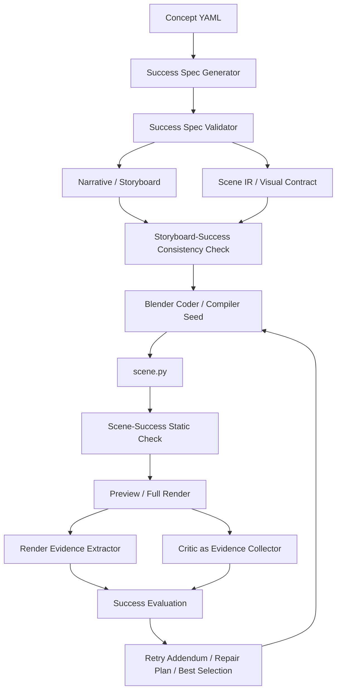

# Success Spec 约束闭环架构方案

> 本版本(v3)在 v2 的基础上增加 Auto Success Spec 软门禁路径:
> 用户仍只写普通 concept YAML, pipeline 自动生成影子 success spec artifact,
> 默认只作为 retry/selection 的软证据,不在首轮形成 hard gate。

## 0. 当前实现状态快照

本文档最初是下一阶段路线图。当前代码已经完成了其中一部分,并根据实验结果调整了方向:

### 已落地

- `src/cg_tutor/success_spec.py`:手写 `success_spec:` schema、闭集校验、`hud_overlay` / `in_scene` text placement、coder 格式化。
- `src/cg_tutor/auto_success_spec.py`:自动生成软 Success Spec,输出 `success_spec.generated.json`、`success_spec.validation.json`、`success_spec.effective.json`。
- `ConceptMetricIssue.failure_class`:在旧 `block/warn` 外新增 `structural_fatal`、`success_hard`、`success_soft`、`aesthetic_warn`。
- Success Spec 静态检查:文字镜像、camera-facing evidence、HUD camera parenting、DoF aperture/focus transition 等进入 concept metrics。
- Auto Success Spec 静态状态:metric report 中记录 `anchor_status`,用于区分“对象未创建”和“对象存在但不可见”。
- Critic partial success aggregation:critic member 同时有 issues 和 execution errors 时仍参与聚合,并写出 `critic_iterNN.member_usable_summary.json`。
- Repair addendum 最简修复原则:success-hard 修复优先编辑已有对象,避免无谓增加 label/helper。
- `AddendumBundle`:将 priority / metric / cross-ref / contract / auto spec 等 addendum 收拢,减少 `_join_addenda` 参数膨胀。
- Best selection 硬隔离:structural / success hard 优先于 aesthetic score;同等硬状态下再比较语义 blocker、score 和 fallback degraded。
- Fallback 降级标记:`compiled_fallback` 可作为诊断视频,但 `fallback_degraded=true` 时不能伪装成 pass。
- Vector/Ray minimum scaffold:对 mirror / prism / ray / vector-heavy 场景给 coder 和 compiler 提供最小 ray/normal/angle/text 骨架。

### 方向调整

最初文档强调少量手写 `success_spec:` 作为 MVP。但阶段实验说明:普通使用者不可能为每个 concept 手写 success spec 或 metric。因此当前默认路径已经调整为:

```text
普通 concept YAML
  -> 自动生成 Auto Success Spec
  -> 默认 success_soft / diagnostic
  -> critic evidence + AST 反证
  -> 当前 run 内临时升级或降级
```

手写 `success_spec:` 仍保留,但只适合高价值基准概念;它不是普通用户的必要输入。

### 仍未落地

- 真正的 render evidence extractor,例如基于 bbox / crop 的 sharpness ordering、frame-difference by success state。
- Critic schema 的完整 observed-vs-expected 输出。目前仍主要依赖旧 issue schema + evidence/free text 映射。
- Compositor 级 HUD overlay。当前短期方案仍是 Blender 伪 HUD:parent 到 camera、固定 local transform、禁止 negative scale。
- `RenderConfig` / `GenerationState` 对 `pipeline.py` 的进一步拆分。
- 对所有 concept 批量编写 Success Spec。当前明确不做,避免规则泛化造成负优化。

### 当前保守策略

- generated rule 不在 iter00 hard fail。
- `helper_hidden` 永不升级为 `success_hard`。
- `object_visible` 只有在 critic 连续确认缺失且 AST 也找不到对象时才升级 hard。
- AST 已创建但 critic 看不见时,归因为 `auto_success_visibility_unproven success_soft`,提示移动/缩放/转向/取消裁切已有对象,而不是创建重复 anchor。
- fallback 结果可以交给 critic 诊断,但不代表语义成功。

## 1. 背景与问题重定义

当前 CG-Tutor 已经不再是简单的 "LLM 生成 Blender 脚本" 流程。系统里已有 scene verifier、contract validator、preview、concept metrics、critic ensemble、critic × AST cross-reference、failure memory、compiled scaffold fallback 等多层防线。这些模块确实解决了很多全局问题,例如:

- render 前拦截语法、引擎、路径和 API 兼容错误。
- 用 visual contract 检查 anchor / label / vector 是否存在。
- 用 concept metrics 捕获一部分高置信概念失败。
- 用 critic ensemble 和 cross-reference 把视觉症状回灌给下一轮 coder。
- 用 compiled scaffold 避免 LLM 完全失败时没有可渲染产物。

但纵观最近的动态概念实验,一个更深的问题已经暴露出来:系统仍然主要是在 **生成结果之后发现失败,再把失败模式补成新规则**。这比纯 prompt 更稳,但本质上仍然是结果驱动的护栏堆叠。换一个新场景后,旧护栏能避免旧坑,却不保证系统真正理解新概念"成功应该长什么样"。

下一阶段的目标不是继续无限增加零散 verifier / metric,而是把架构升级为:

```text
先定义成功状态,再生成;每一层都验证成功状态是否被保留。
```

本文档提出 `Success Spec` 层,作为 concept YAML 与 narrative/storyboard/scene.py 之间的机器可读成功标准。

## 2. DoF 案例暴露的核心缺口

`depth_of_field_focus_pull` 是一个典型反例。最终 iter05 已经满足很多代码层条件:

- `camera.data.dof.use_dof = True`
- `camera.data.dof.focus_distance` 有 keyframe
- `aperture_fstop` 在合理范围
- 三个 subject anchor 都存在
- deterministic concept metric 为 0 block / 0 warn
- preview render 无 block

但最终视频仍然不合格:

- depth labels 和 HUD 镜像,文字不可读。
- DoF 视觉变化太弱,三层物体看起来都比较清楚。
- HUD 被景深和构图影响,像模糊发光条。
- distant bokeh dots 没形成明显背景散景。

这说明当前系统检查的是 "代码属性是否存在",而不是 "教学目标是否达成"。换句话说:

```text
focus_distance 被 keyframe 了 != 观众能看出焦点从近处移动到远处。
文本对象存在            != 文本可读。
bokeh dots 被创建        != 背景散景可见。
```

这些不是单纯多写 concept YAML 自然语言就能稳定解决的问题。自然语言意图必须被编译成可验证、可追踪、可反馈的成功标准。

## 3. Success Spec 的定位

新增链路:

```text
Concept YAML
  -> Success Spec
  -> Narrative / Storyboard
  -> Scene IR / Visual Contract
  -> scene.py
  -> Static Checks
  -> Render Evidence
  -> Critic Evidence
  -> Retry / Best Selection
```

Mermaid 视图:



`Success Spec` 描述每个阶段应该被观众看见和理解的状态,而不只是列出对象名。它应该回答:

- 哪些对象必须可见?
- 哪些对象必须清晰、模糊、移动、静止、发光、隐藏?
- 哪些文本必须可读且朝向相机?
- 哪些属性变化必须在像素层产生可见差异?
- 哪些失败即使代码结构正确也应该判失败?

## 3.5 与现有层的关系与边界(不要重复发明)

新增 Success Spec 时**必须明确**它跟下列五层的关系。否则一定会发生:同一份知识在两处写、互相漂移、debug 时不知道哪份权威。

| 现有层 | 粒度 / 时间维度 | Success Spec 与它的关系 |
|---|---|---|
| `visual_contract.py` (`VisualContract`) | **per-shot**,列必须存在的 anchor/label/vector 名字 | **互补,不替换**。visual_contract 答 "这个 shot 要有 X 名字的物体";Success Spec 答 "整个 concept 的关键时刻里 X 必须 sharp / readable / glowing"。Success Spec 是跨 shot 的时间-状态序列。 |
| `scene_profiles.py` (`SceneProfile`) | 整个 concept,风格策略(允许什么 helper、禁用什么 abstraction) | **互补,正交**。scene_profile 管"画面长成什么风格"(cinematic 不许 formula overlay);Success Spec 管"画面里看不看得见教学目标"。重叠的 `forbidden_abstractions` ↔ `forbidden_success_failures` 必须二选一,本文档选择**不引入新的禁用字段**,保留 scene_profile 的 `forbidden_abstractions` 作为唯一来源。 |
| `concept_metrics.py` (插件注册表) | 整个 concept,AST 层规则 | **被 Success Spec 重用为 Scene-Success Static Check 的实现层**。不新建模块。每个插件的协议扩展一个 `success_spec` 参数,把违反报为 finding。已有 DoF / particle / shadow / dolly_zoom 4 个插件继续工作。 |
| `critic_cross_reference.py` (Phase 3 已落地) | per-iter,把 critic 自由文本与 AST 双向 corroborate | **Phase 4 跟 critic schema 一起演化**。Success Spec 提供结构化 expected,cross-ref 从"正则猜 token"升级为"对比 observed vs expected"。已有的 4 条规则(missing_object_creation / misnamed_object / keyframe_ramp_too_late / object_hidden_at_frame)保留为兜底。 |
| `preview.py` (`_mean_frame_diff`, `_edge_activity_risk`, `_overlay_occupancy_risk`) | per-frame,渲染后图像 heuristic | **Render Evidence Extractor 直接调用其 helper,不重写**。`_mean_frame_diff` 已经是 frame_difference_probe 的 90%,只需要按 success_state 的 frame_range 切片。 |

**单一权威原则**:同一份事实只允许一处声明。当 Success Spec 想说"FG/MG/BG 必须可见"时,它应该 **引用** visual_contract 已经列出的 `required_anchors`,而不是另开一份 `visible: [...]` 重复列。具体写法见 §4 的修订 schema。

## 3.6 Auto Success Spec 软门禁 rollout

手写 `success_spec:` 适合高价值基准场景,但不能要求普通使用者为每个概念手写规则。v3 增加自动生成层:

```text
Concept YAML
  -> Narrative / Scene Profile
  -> Auto Success Spec
  -> Storyboard
  -> Visual Contract / Scene IR
  -> scene.py
  -> Preview / Render / Critic / Selection
```

每次 run 生成三个 artifact:

- `success_spec.generated.json`: 从 concept YAML、narrative、storyboard token 自动推断出的软规则。
- `success_spec.validation.json`: accepted / rejected 统计和拒绝原因。
- `success_spec.effective.json`: 手写 spec 与 generated spec 的合并视图;手写 spec 优先,generated 只补充。

自动 spec 采用受限 DSL,第一阶段只允许:

- `object_visible`
- `text_readable`
- `stay_in_screen_safe`
- `helper_hidden`
- `animation_coverage`
- `progressive_visual_ordering`

生成规则不得凭空创造 anchor。anchor 必须来自 `persistent_anchors`、storyboard object name、narrative/concept 中明确出现的 token(例如 `LOD0/LOD1/LOD2`)。`preview` 这类普通词不能外推成 `view_vector`。

默认门禁策略:

- 手写 `success_spec:` 的 hard rule 仍是 `success_hard`。
- generated rule 初始只允许 `success_soft` / `aesthetic_warn` / `diagnostic`。
- iter00 不得因为 generated spec 直接 hard fail。
- 同一 generated rule 连续 2 个 critic iteration 被 evidence-first 字段确认,且没有 AST/cross-ref 反证时,只在当前 run 内升级为 `success_hard`。
- 升级不写回 YAML,不进入长期全局记忆,避免把一次场景误诊污染到其它概念。

这条路径的目标不是替代手写 Success Spec,而是为没有手写 spec 的普通 concept 提供“影子成功标准”:它能给 retry loop 更具体的修复信号,也能在 final summary 中解释未达标原因,但不会在低置信阶段压过画面质量和 critic 总体判断。

## 4. 建议的 Success Spec 字段(v2 收紧版)

v1 不追求覆盖所有视觉语义,只覆盖当前动态教学场景最常见、最高 ROI 的成功条件。**词汇收成闭集**,以便后续 schema 校验和报错。

```yaml
success_spec:
  version: 1                       # 强制,便于以后向后兼容迁移

  # ── 时间分桶。把 storyboard 切成若干 named state,后续所有 probe 都按 state 引用 ──
  success_states:
    - id: early                    # 标识符闭集: early | middle | late | final
      frame_range:                 # 必填,二选一: 显式区间 或 fraction
        fraction: [0.0, 0.25]      # of total_duration
      object_states:               # 闭集 vocab: visible | hidden | sharp | blurred | static | moving | glow
        foreground_subject: [visible, sharp, static]
        middleground_subject: [visible, blurred, static]
        background_subject: [visible, blurred, static]
      readable_text:               # 受 text_orientation 静态检查保护
        - depth_label_near
        - lens_readout_hud

    - id: middle
      frame_range: { fraction: [0.4, 0.6] }
      object_states:
        foreground_subject: [visible, blurred]
        middleground_subject: [visible, sharp]
        background_subject: [visible, blurred]

    - id: late
      frame_range: { fraction: [0.75, 1.0] }
      object_states:
        foreground_subject: [visible, blurred]
        middleground_subject: [visible, blurred]
        background_subject: [visible, sharp]

  # ── 哪些"成功"需要被像素证据或静态证据 corroborate ──
  required_visual_evidence:
    - kind: frame_difference       # 闭集 kind 列表见 §5 Phase 3
      between: [early, middle, late]
      min_mean_diff: 1.0           # 复用 preview._mean_frame_diff 的 160x90 RGB 度量

    - kind: sharpness_ordering
      orderings:
        - state: early
          sharpest: foreground_subject
        - state: middle
          sharpest: middleground_subject
        - state: late
          sharpest: background_subject

    - kind: aperture_within_range  # 替代 concept_metrics 里写死的阈值
      anchor: main_camera
      data_path: data.dof.aperture_fstop
      range: [1.4, 2.8]

  # ── 不允许被 repair 破坏的、跨 state 的硬约束 ──
  hard_constraints:
    - kind: object_static
      anchors: [foreground_subject, middleground_subject, background_subject, desk_surface]
    - kind: camera_static
      anchor: main_camera
    - kind: text_faces_camera
      anchors: [depth_label_near, depth_label_mid, depth_label_far, lens_readout_hud]
```

字段说明:

- `success_states`: 按 *frame_range* 描述观众应该看到的状态。state id 来自闭集 `{early, middle, late, final}`,确保所有 concept 共享同一节奏词汇。`frame_range` 提供 `fraction: [a,b]` 或 `frames: [n,m]` 两种形式,在加载时一律解析为绝对帧。
- `object_states`: 每个 anchor 映射到一组**闭集 token**(`visible | hidden | sharp | blurred | static | moving | glow`)。新增 token 需要走一次 schema bump。
- `required_visual_evidence`: 每条声明一类 probe + 它需要的输入。`kind` 是闭集,见 §5 Phase 3 的 probe 注册表。
- `hard_constraints`: kind 闭集 `{object_static, camera_static, text_faces_camera}`。可以加,但每次加一个 kind 都要同时在 §5 Phase 2 的 static check 里实现。
- **删掉 v1 中的 `forbidden_success_failures`**: 该字段第一版 ROI 太低,且大部分(`text_mirrored`、`all_subjects_equally_sharp`、`hud_blurred_by_scene_dof`)都可以从 `hard_constraints` + `success_states` 推导。v2 数据驱动地再加回来。
- **删掉 v1 中的 `verification_targets`**: 由 §5 Phase 3 的 probe registry 替代,probe 自己声明自己消费哪类字段。

`object_states` 中的 anchor 名字**必须**已经在该 concept 的 `persistent_anchors` 里出现过,加载时校验。这保证 Success Spec 不会引入新对象。

## 5. 分层实现方案

### Phase 0.5(前置:必须先做):AddendumBundle 骨架

Phase 2-4 会向 [pipeline.py:1894-1904](src/cg_tutor/pipeline.py#L1894-L1904) 的 `_join_addenda(...)` 再加 2-3 个字符串参数(`success_static_addendum`、`success_evidence_addendum`)。当前已经有 8 个参数,再加就难维护。先做一个最小 dataclass:

```python
@dataclass
class AddendumBundle:
    priority: str = ""
    metric: str = ""
    cross_ref: str = ""
    shot_contract: str = ""
    grounding_patch: str = ""
    critic_visual_evidence: str = ""
    multi_reference: str = ""
    history: str = ""
    repair_plan: str = ""

    def join(self) -> str:
        return _join_addenda(
            self.priority, self.metric, self.cross_ref, self.shot_contract,
            self.grounding_patch, self.critic_visual_evidence,
            self.multi_reference, self.history, self.repair_plan,
        )
```

50 行,行为 1:1 等价,无功能改动。后续 Phase 加字段就是给 dataclass 加属性而不是改 `_join_addenda` 签名。**这一步不动 pipeline.run() 主控流**,仅替换 addendum 拼接调用点。

### Phase 1:Success Spec schema 与第一份手写 spec(只覆盖 DoF)

**v1 不做 Python adapter,也不做 LLM 生成。** 直接在 concept YAML 顶层加一段 `success_spec:` 块,人手写。3 个 concept = 3 段 YAML。这个决定的原因:

- adapter 写出来就是 `if concept_id == "...": return SuccessSpec(...)` 的 if-ladder,与"在 YAML 里就写明"信息量一致而冗余度更高。
- LLM 生成版本是 *中期* 目标,要等 Schema 稳定且有≥10 个手写样例后再启动,防止 LLM 在 schema 设计期就漂移。

新增模块和 artifact:

- `src/cg_tutor/success_spec.py`: pydantic 模型 + YAML 解析 + frame_range 解析(`fraction` → 绝对帧)+ 闭集 token validator。
- `success_spec.json`(per-run, **只读**): pipeline 启动时把 `concept.success_spec` 解析后写到 `out_dir/success_spec.json`,与 storyboard.json 同级。所有下游层只读这一份。
- `success_evaluation.iterNN.json`(per-iter): 每轮 static + render evidence 的合并报告。

首份手写 spec:**只写 `depth_of_field_focus_pull`**。particle / shadow 在 §5.6 的 MVP 完成后再补。

### Phase 2:Storyboard-Success Consistency Check + Scene-Success Static Check

#### 2a. Storyboard-Success Consistency Check(轻,在 storyboard 后立即跑)

仅做 *只读断言*,**不触发 storyboard repair**(那是 Phase 6+):

- 每个 `success_state.object_states` 的 anchor 是否在 storyboard 某个 shot 的 `objects[].name` 中出现。
- 每个 state 的 `frame_range` 解析后是否被 storyboard 的总帧数覆盖。
- `readable_text` anchor 是否对应至少一个 `type=text|annotation` 的 shot object。

失败 → 添加一条 `consistency_block` 到 verifier_report,与现有 scene_verifier 同口径。不在这里改 storyboard。

#### 2b. Scene-Success Static Check(**复用 concept_metrics 插件**,不新建模块)

扩展 `_ConceptMetricPlugin` 协议:

```python
@register_concept_metric("depth_of_field_focus_pull")
def _depth_of_field_focus_pull_metrics(
    *,
    tree: ast.Module,
    storyboard: Storyboard,
    scene_profile: SceneProfile | None,
    success_spec: SuccessSpec | None = None,  # NEW, optional
) -> list[ConceptMetricFinding]: ...
```

签名向后兼容(默认 None)。插件内部当 `success_spec is not None` 时:

- 用 `success_spec.hard_constraints[object_static].anchors` 查 AST 里这些 anchor 是否有非 `hide_*` 的 keyframe → 有就报。
- 用 `success_spec.hard_constraints[text_faces_camera].anchors` 查 text object 是否有负缩放 / 朝向相机的 rotation/constraint(详见下条)。
- 用 `success_spec.required_visual_evidence[aperture_within_range]` 替代当前写死的 `1.4` 阈值。

**新增的通用静态规则(不属于任何 concept 插件)**:

- `text_faces_camera_check`: 对所有 `bpy.data.objects.new(name, ...)` 中 type=FONT(text)且名字属于 `success_spec.hard_constraints[text_faces_camera].anchors` 的对象,检查:
  - scale 没有任一分量 < 0(避免镜像)。
  - 至少出现以下之一:`constraints['Track To']` / `track_axis='POS_Y'+up_axis='UP_Z'` / 手动设定的 `rotation_euler` 指向 camera location。
  - 失败 → 报 `text_orientation_block` finding。

将该规则放在 `concept_metrics.py` 底部 *作为* generic helper plugin(`@register_generic_metric` 新装饰器,与 concept plugin 平行注册)。

DoF 的 `text_mirrored` 失败模式由此一步拦截,不需要 render 后才发现。

### Phase 3:Render Evidence Extractor

新模块 `src/cg_tutor/render_evidence.py`,但 **直接调用 `preview.py` 已有的 helper**:

```python
from cg_tutor.preview import _mean_frame_diff  # 复用
```

实现一个 **probe registry**(类似 concept_metrics 的模式):

```python
@register_probe("frame_difference")
def _probe_frame_difference(
    *, spec_entry, success_spec, frames_dir, frame_resolutions,
) -> ProbeFinding: ...
```

v1 实现的 probe kind 闭集:

| kind | 输入 | 数据来源 | 决策 |
|---|---|---|---|
| `frame_difference` | `between: [state, state]` | `preview._mean_frame_diff` 在两个 state 中点采样的帧间均值 | mean_diff < `min_mean_diff` → warn(non-blocking) |
| `sharpness_ordering` | `orderings: [{state, sharpest}]` | 在每个 state 中点帧上对每个 object 取 2D bbox crop → Laplacian variance | 排序不符 → warn |
| `aperture_within_range` | `data_path, range` | **静态**,从 AST 取最终值或 keyframe min/max | 越界 → block |

**object mask 来源决策(v1 提交)**:

- 对每个 `object_states` anchor,scene.py 在 preview/full render 时**额外输出一个 `bbox_meta_frame_NNNN.json`**,内容是该帧每个命名 object 的 2D screen-space bounding box(由 `world_to_camera_view` 派生)。
- `render_evidence.py` 读这份 json 做 crop。
- Cryptomatte AOV 是 v2 选项(精度更高但要改渲染配置)。

**text orientation 不放在 render evidence**(已经在 Phase 2 静态拦截);仅在静态检查放行后才进入 render 阶段,因此 render 端不需要重做。

**bokeh_presence_probe** 在 v1 **不实现**:启发式像素检测太脆弱,会把暗噪点误报为 bokeh。等 Phase 4 critic 改造完拿到结构化 observed 后再说。

### Phase 4:Critic 改为 observed-vs-expected(向后兼容增量)

**关键决策:不替换 CriticReport schema,只增量扩展。**

`CriticIssue` 加 3 个 optional 字段:

```python
class CriticIssue(BaseModel):
    model_config = ConfigDict(extra="ignore")
    shot_id: str
    frame_idx: int
    severity: Severity
    category: IssueCategory
    issue: str
    suggested_fix: dict = Field(default_factory=dict)
    # NEW (all optional, default None to preserve all existing flows)
    success_state: str | None = None       # e.g. "middle"
    observed_state: dict | None = None     # {"sharp": [...], "blurred": [...], "readable_text": [...]}
    expected_state: dict | None = None     # mirror of success_spec for this state
```

`prompts/critic.txt` 在结尾追加一段(不删任何现有指令):

```
If a `success_spec` block is provided, when emitting a concept_mismatch
issue, also fill `success_state`, `observed_state`, `expected_state`
using the closed vocabulary {visible, hidden, sharp, blurred, static,
moving, glow, readable}. Leave them null if you cannot determine.
```

**`critic_cross_reference.py` 同步演化**:

- 增加 R5 `success_state_violation`:critic 填了 `observed_state` 且与 `expected_state` 有差 → 直接出 actionable finding(因为是 critic 自己 corroborate 的,不需要 AST 再 corroborate 一遍)。
- R1-R4 不动,作为兜底(当 critic 没填新字段时,旧的正则抽取路径仍生效)。

这样 cross-reference 层不再需要从自由文本里猜 token,也能减少把 `derived_visual_contract` 这种诊断术语误当成对象 anchor 的错误。

### Phase 5:pipeline 控制状态整理(在 Success Spec 信号跑通之后)

继续 Phase 0.5 的 dataclass 抽取:

- `RenderConfig`:收拢 `render_engine`、`cycles_device`、samples、denoising、preview/full render 参数(目前 11 处分散调用)。
- `AddendumBundle`(Phase 0.5 已经有):此时加入 `success_static`、`success_evidence` 字段。
- `GenerationState`:收拢 `critic_history、metric_history、cross_ref_history、success_history、scene_origin、best_selection`。

这不是第一优先级。先让成功标准流过 pipeline,再整理控制面。

### 5.6 First MVP(DoF only,可独立交付)

**目的**:在 Phase 1-3 完整实施之前,用最少代码、最短路径,跑通一个端到端的"声明成功 → 守住成功"循环,验证 schema 是否够用。

**只动这些**:

1. `success_spec.py`(新,~200 行):pydantic schema + YAML 解析 + frame_range 解析。
2. `configs/concepts/depth_of_field_focus_pull.yaml`:加 §4 示例那段 `success_spec:` 块。
3. `concept_metrics.py:_depth_of_field_focus_pull_metrics`:接收可选 `success_spec`,把硬编码 `1.4` 替换为 `success_spec.required_visual_evidence[aperture_within_range].range`。
4. `concept_metrics.py` 新增 generic `text_faces_camera_check`:扫描 text object 是否有负 scale 或缺失 track-to。
5. `pipeline.py`(2 处):
   - 启动时载入 success_spec,写到 `out_dir/success_spec.json`。
   - 把 success_spec 传给 `run_concept_metrics`。

**通过条件**:重跑 `depth_of_field_focus_pull`,iter00 静态检查直接抓住 text mirroring(无需 render);iter02 aperture 阈值从 YAML 而非 Python 来。

Phase 3 的 render evidence、Phase 4 的 critic schema 扩展、particle / shadow concept 的 spec 都**不在 MVP 内**,等 MVP 跑通确认 schema 够用再推进。

## 6. DoF 失败到 Success Spec 的映射

| 当前失败 | Success Spec 约束 | 检查层 | 阻塞? |
|---|---|---|---|
| 文字镜像 | `hard_constraints[text_faces_camera]` | Scene-Success Static Check(Phase 2b 新增 generic) | **block** |
| DoF 太弱 | `required_visual_evidence[sharpness_ordering]` | Render Evidence Extractor + Critic observed_state | warn → 多轮 warn 升 block |
| HUD 模糊不可读 | `hard_constraints[text_faces_camera]` + `success_states[*].readable_text` | Static(text orientation) + Critic observed_state | block(text)/ warn(readable) |
| bokeh 不明显 | (v1 不做) | — | — |
| 前半段几乎静止 | `required_visual_evidence[frame_difference]` | Render Evidence Extractor(复用 `preview._mean_frame_diff`) | warn |
| 代码 keyframe 存在但视觉不成立 | `required_visual_evidence[sharpness_ordering]` | Render + Critic | block(若 critic 与 evidence 一致) |
| aperture 阈值漂移 | `required_visual_evidence[aperture_within_range]` | Scene-Success Static Check(替代 concept_metrics 硬编码) | block |

## 6.1 Hard Gating 与推广边界

Success Spec 的硬门禁必须保持 opt-in:

- 只有 concept YAML 显式声明 `success_spec:` 时,`success_hard` 才参与 pass / best selection 的硬隔离。
- 未声明 `success_spec:` 的 concept 继续只跑 legacy metric。legacy 阈值最多进入 `success_soft` 或 `aesthetic_warn`,不参与 Success Spec hard gating。
- 不批量为所有 concept 预写 Success Spec。每新增一个 concept 的 spec 前,先跑至少两轮 baseline,记录 critic / cross-ref 反复出现且人工确认真实的问题。
- spec 只写“反复确认的成功条件”,不要把理论上可能有用的规则预先塞进去;否则会把生成器推向规则堆砌,牺牲画面质量。

当前短期 HUD 方案是 Blender 伪 HUD,不是 compositor overlay: `placement: hud_overlay` 的 text anchor 应 parent 到 render camera,保持固定 local placement,避免被场景 DoF 或深度遮挡影响。真正 2D compositor/burn-in overlay 暂不作为短期目标。

## 7. 非目标(明确不做)

短期内不要继续沿着以下方向扩张:

- 不为每个新场景无限手写 concept metric。新增 concept 走 success_spec YAML + 复用 generic static checks 路线。
- 不把所有视觉判断都交给 VLM critic。
- 不试图用更长 prompt 解决所有概念失败。
- 不立即大拆 `pipeline.py`(只做 Phase 0.5 的 AddendumBundle 抽取这种 1-2 小时级整理)。
- 不把 Success Spec 设计成任意视觉语言;第一版只覆盖高频动态教学模式。
- **不为 Success Spec 写 deterministic concept→spec adapter Python 代码**,直接 YAML。
- **不在 Phase 2 做 storyboard repair**;repair 推到 Phase 6+。
- **不替换 `CriticReport` schema**;只增加可选字段。
- **不重写 `visual_contract` / `scene_profile`**;它们继续负责各自的职责。

## 8. 首批验收场景

### `depth_of_field_focus_pull`(MVP 必过)

通过条件:

- 文本不镜像,`d_near` / `d_mid` / `d_far` / HUD 可读(由 `hard_constraints[text_faces_camera]` 静态拦截)。
- early/middle/late 三个阶段的 sharpness ordering 与 Success Spec 一致。
- subjects 和 camera 保持静止(由 `hard_constraints[object_static]` 静态拦截)。
- frame difference 显示焦点变化可见。

### `particle_trail_curve`(MVP 后第二个验收)

通过条件:

- trail curve 从 0 到 1 reveal,且不只在最后一小段出现(`object_states[trail_curve]: [visible, glow]` from early)。
- emitter 沿轨迹移动(`object_states[glow_emitter]: [moving]`)。
- early/middle/late 帧能看出轨迹逐步增长(`required_visual_evidence[frame_difference]`)。
- trail 和 emitter 同步(`required_visual_evidence[anchor_position_match]`,Phase 3 新增 kind)。

### `shadow_softness_radius`(MVP 后第三个验收)

通过条件:

- subject 和 ground 可见且静止(`hard_constraints[object_static]`)。
- 真正 light 的 size / shadow_soft_size 变化,而不是 label size(已由 concept_metrics 的 `_is_light_receiver_name` 拦截,success_spec 把它显式化)。
- early shadow hard,late shadow soft(`object_states[ground_plane]: [..., hard_shadow → soft_shadow]`,需要把 vocab 扩到含 `hard_shadow|soft_shadow`,Phase 3 决定)。
- render evidence 能检测到阴影边缘扩张(`required_visual_evidence[shadow_edge_expansion]`,Phase 3 新增 kind)。

## 9. 推荐落地顺序

1. **Phase 0.5**: 抽 `AddendumBundle` dataclass,1-2 小时。无功能改动。
2. **Phase 1 + MVP(DoF only)**: 新增 `success_spec.py` schema,DoF YAML 加 spec 块,把 `_depth_of_field_focus_pull_metrics` 的 aperture 阈值换成读 spec,加 generic `text_faces_camera_check`。跑一次 DoF 验证 schema 够用。
3. **Phase 2 (storyboard 一致性 + 其余 static check)**: 在 storyboard 后加 consistency check,把 `object_static` / `camera_static` 拆成 generic plugin。给 particle / shadow YAML 补 spec 块。
4. **Phase 3 (render evidence)**: 实现 `render_evidence.py`,3 个 v1 probe(frame_difference, sharpness_ordering, aperture_within_range)。Scene.py 渲染时输出 `bbox_meta_frame_NNNN.json`。
5. **Phase 4 (critic schema 增量 + cross-ref R5)**: CriticIssue 加可选字段,critic prompt 末尾追加指令,cross-ref 加 R5。
6. **Phase 5 (pipeline 控制状态整理)**: `RenderConfig` / `GenerationState`。
7. **Phase 6+**: storyboard repair driven by success spec violations、LLM `success_spec_generator`、Cryptomatte mask 升级、bokeh probe。

目标不是一口气让所有场景完美,而是让系统从:

```text
发现失败 -> 添加补丁
```

升级为:

```text
声明成功 -> 逐层守住成功 -> 用证据解释失败
```

并且每一 Phase 都 *能独立落地、独立验收*,不依赖后续 Phase 完成。
